# Explore Lebanon

## Project Description
Explore Lebanon is a tourism website developed using ReactJS. The project allows users to discover destinations, landmarks, activities, hotels, traditional food, and travel experiences across Lebanon through a modern and interactive interface.

The website was built as a Single Page Application (SPA) using React Router to provide smooth navigation between pages without reloading the browser.

## Technologies Used
- ReactJS
- React Router DOM
- JavaScript (ES6)
- HTML5
- CSS3
- Vite

## Features
- Client-side Routing
- Dark Mode
- Search Functionality
- Favorites System
- Contact Form Validation
- Scroll To Top Button
- Responsive Design

## Setup Instructions

### Install Dependencies
```bash
npm install
```

### Run the Project
```bash
npm run dev
```

### Open in Browser
```text
http://localhost:5173
```

## Screenshots

### Home Page
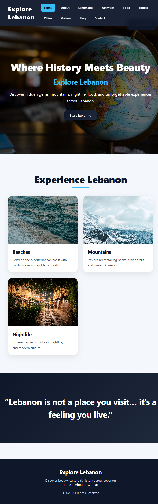

### About Page
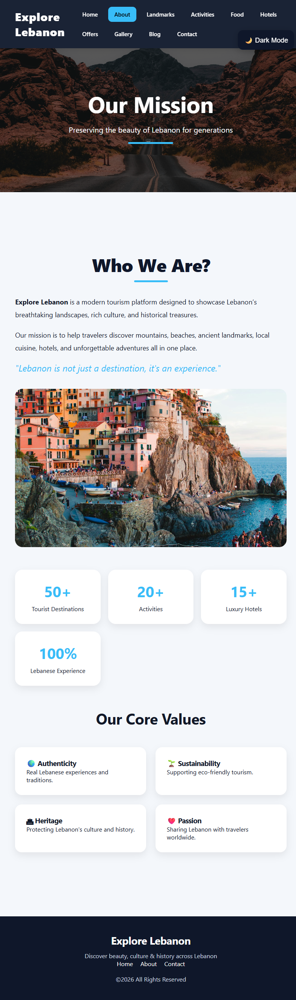

### Activities Page
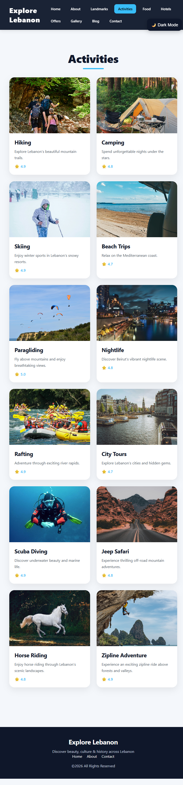

### Blog Page
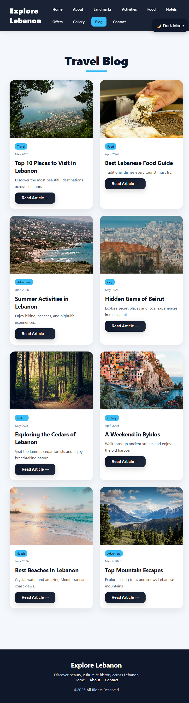

### Contact Page
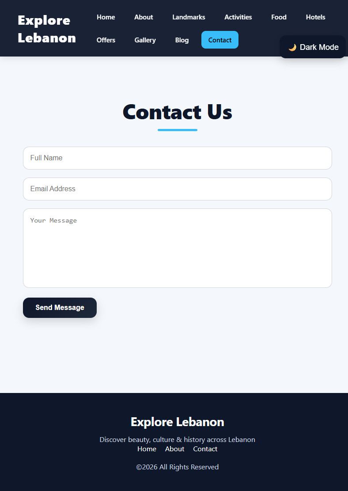

### Destinations Page
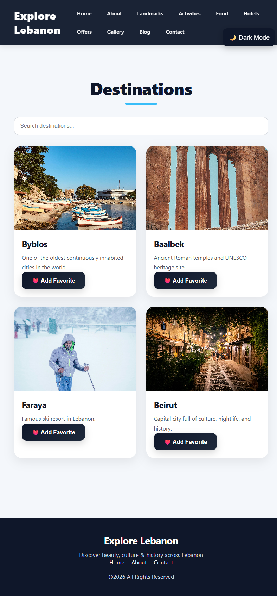

### Food Page
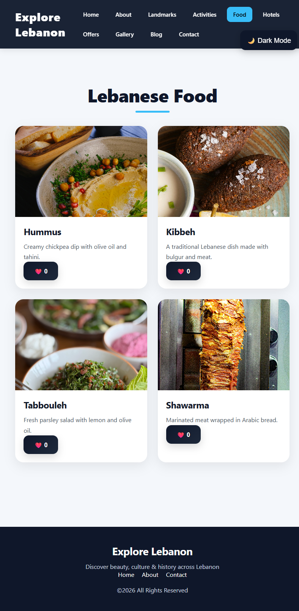

### Gallery Page
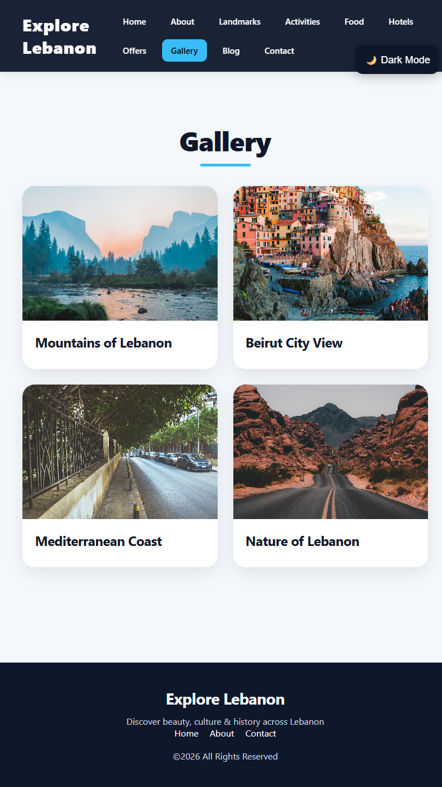

### Hotels Page
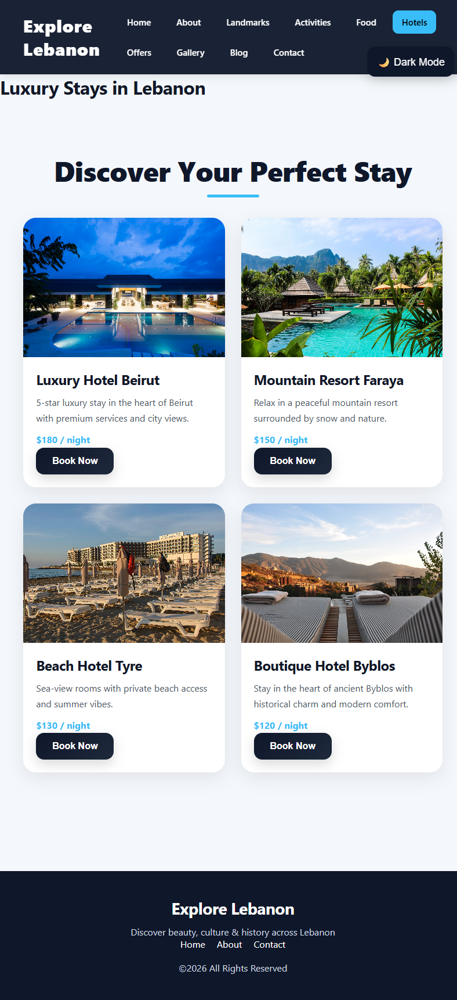

### Landmarks Page
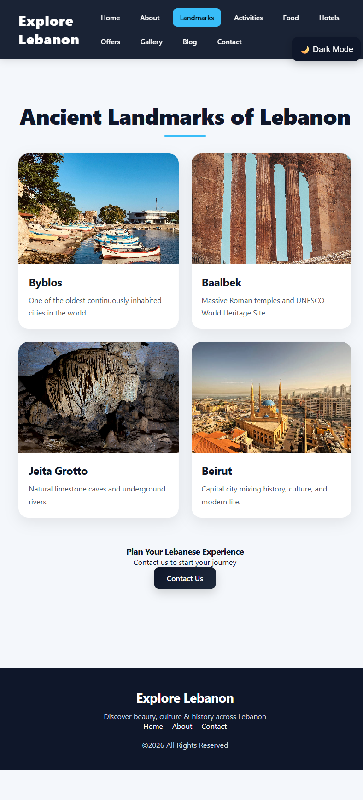

### Offers Page
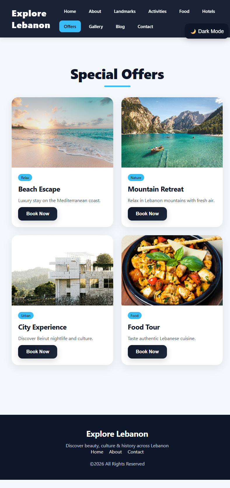

### Dark Mode
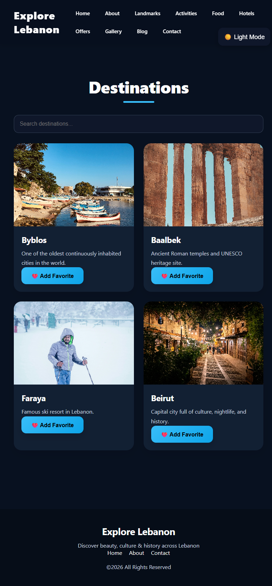

## Team Members
- Jana Serrieh
- Rawan Abou Alloul
